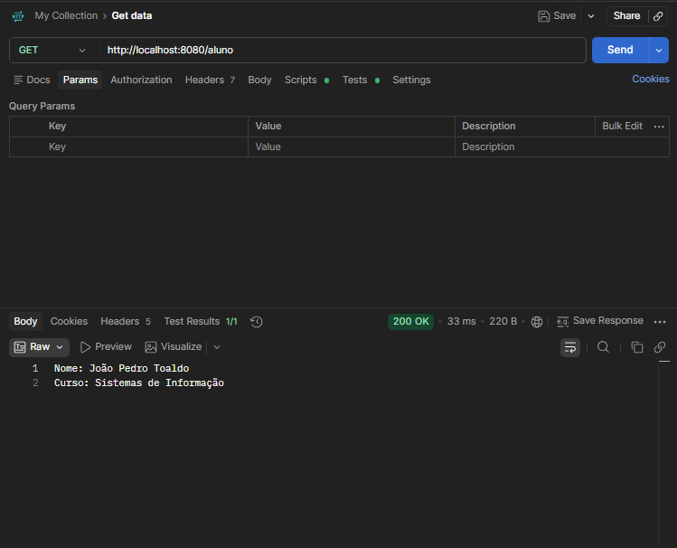
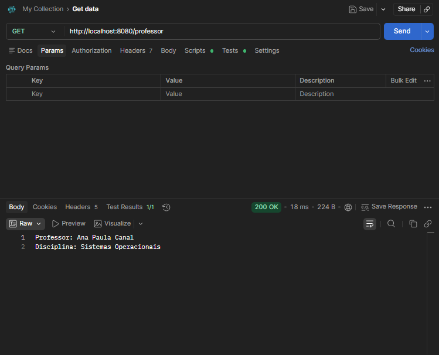
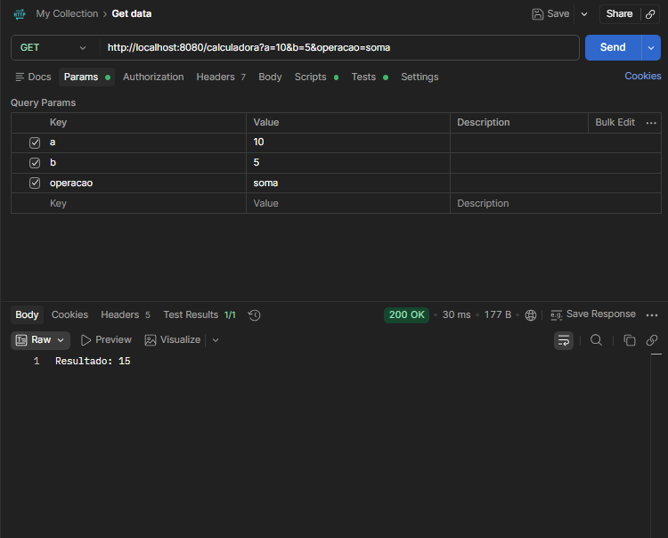
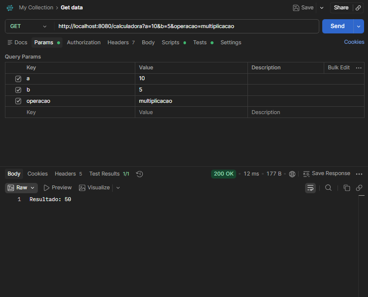
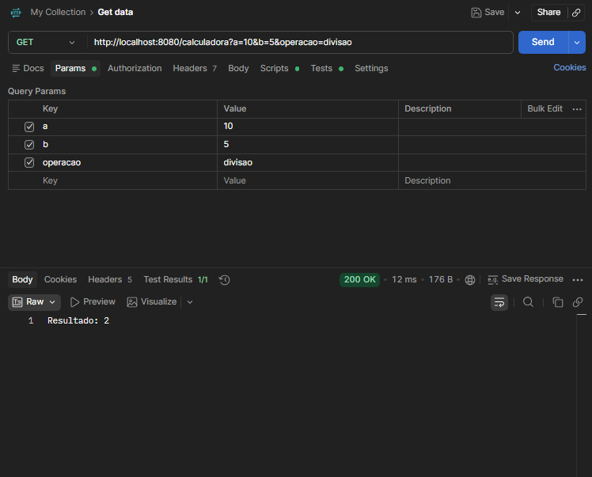

# Testes dos Endpoints

Aqui estão registrados os testes realizados nos endpoints da API para validar o funcionamento.

### 1. Aluno
* **URL:** `http://localhost:8080/aluno`
* **Retorno:**

### 2. Professor
* **URL:** `http://localhost:8080/professor`
* **Retorno:**

### 3. Calculadora
* **Soma:**
* **URL:** `http://localhost:8080/calculadora?a=10&b=5&operacao=soma`
* **Retorno:**

* **Subtração:**
* **URL:** `http://localhost:8080/calculadora?a=10&b=5&operacao=subtracao`
* **Retorno:**

* **Multiplicação:**
* **URL:** `http://localhost:8080/calculadora?a=10&b=5&operacao=multiplicacao`
* **Retorno:**

* **Divisão:**
* **URL:** `http://localhost:8080/calculadora?a=10&b=5&operacao=divisao`
* **Retorno:**

